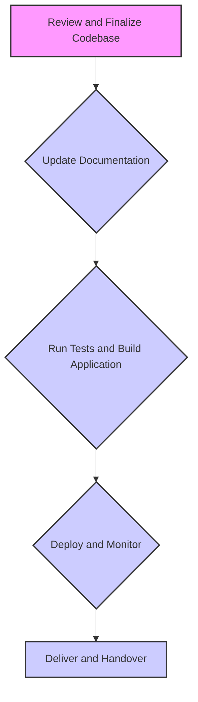

# Sentinel Pro Development Deliverables🛡️

---

**Objective:**

Transform the Sentinel Pro codebase into a production-ready state, exceeding beta requirements and establishing a new standard for quality. Ensure the application is robust, performant, secure, scalable, and maintainable, ready for immediate deployment with zero-defect tolerance.

---

### **Scope of Work:**

1.  **Codebase Finalization:**
    *   Achieve **complete feature parity** with the original specifications, including all core backup management and AI-powered assistance features.
    *   Ensure **zero-defect tolerance** by meticulously eliminating all identified bugs, edge-case vulnerabilities, and performance bottlenecks.
    *   Implement **advanced debugging and profiling techniques** to optimize performance and reliability.

2.  **Integration and Compatibility:**
    *   Guarantee **seamless integration** of all features, including advanced functionalities and optional modules.
    *   Maintain **absolute backward compatibility** with existing integrations.
    *   Proactively implement **automated preventative measures** against regressions and future defects, including:
        *   Robust static analysis, dynamic analysis, and comprehensive CI/CD pipelines.
        *   Automated rollback capabilities for deployment.

3.  **Documentation:**
    *   Generate **comprehensive, user-focused documentation**, including:
        *   Detailed API references.
        *   Interactive tutorials for both novice and expert users.
        *   Proactive troubleshooting guides.
    *   Update the documentation to reflect all newly implemented robust enhancements.

4.  **Testing Strategy:**
    *   Implement a **multi-tiered testing strategy** encompassing:
        *   Unit, integration, end-to-end, performance, security, and usability testing.
        *   Achieve **100% code coverage**, including branch and condition coverage.
        *   Demonstrate resilience under extreme load conditions, including stress, soak, and spike testing.
        *   Automate performance regression detection.
    *   Ensure all tests pass with a **100% success rate**.

5.  **Code Quality and Security:**
    *   Prioritize **code maintainability, scalability, and security** by adhering to industry-leading coding standards (e.g., SOLID principles, secure coding practices).
    *   Enforce **automated code style enforcement** and vulnerability scanning (SAST, DAST, IAST).
    *   Manage dependencies with **automated updates and vulnerability patching**.
    *   Ensure **no high/critical vulnerabilities** are present in the codebase.

6.  **Performance and Benchmarks:**
    *   Exceed documented performance benchmarks, including:
        *   Backup creation and restoration times.
        *   Compression ratios.
        *   AI response times.
        *   UI responsiveness.
        *   Memory and CPU usage.
    *   Ensure the application performs optimally under **extreme load conditions**.

7.  **User Experience and Interface:**
    *   Deliver a **modern and robust user interface design** that is intuitive and user-friendly.
    *   Ensure the UI is responsive, with latency under **100ms**.
    *   Maintain a cohesive and intuitive user experience across all features.

8.  **Deployment and Monitoring:**
    *   Configure **automated monitoring and alerting** for the production environment.
    *   Ensure the final deliverable is ready for **immediate deployment**.
    *   Implement **real-time performance metrics tracking** and resource usage monitoring.

---

### **Deliverables:**

1.  **Production-Ready Codebase:**
    *   Fully tested, optimized, and documented codebase.
    *   Zero defects, complete feature parity, and superior performance.

2.  **Updated Documentation:**
    *   Comprehensive API references, tutorials, and troubleshooting guides.
    *   Documentation reflecting all newly implemented enhancements.

3.  **Testing Reports:**
    *   Detailed reports on unit, integration, performance, and security tests.
    *   Evidence of 100% code coverage and test pass rate.

4.  **Performance Benchmarks:**
    *   Metrics demonstrating performance exceeding documented benchmarks.
    *   Results from stress, soak, and spike testing.

5.  **Deployment Package:**
    *   Fully configured application with automated monitoring and alerting.
    *   Ready for immediate deployment to a production environment.

---

### **Steps to Execute:**

1.  **Review and Finalize Codebase:**
    *   Conduct a thorough code review to identify and fix any remaining issues.
    *   Optimize performance and ensure all features are fully integrated.

2.  **Update Documentation:**
    *   Revise the README and other documentation to reflect the latest enhancements.
    *   Ensure all new features and changes are clearly documented.

3.  **Run Tests and Build Application:**
    *   Execute the full suite of tests (unit, integration, performance, security, etc.).
    *   Build the application and verify it meets all performance benchmarks.

4.  **Deploy and Monitor:**
    *   Deploy the application to a staging environment for final validation.
    *   Configure monitoring and alerting for the production environment.

5.  **Deliver and Handover:**
    *   Provide the final production-ready codebase, documentation, and test reports.
    *   Conduct a handover session to ensure smooth transition to production.

---

### **Key Metrics for Success:**

*   **Code Coverage:** 100%
*   **Test Pass Rate:** 100%
*   **Static Analysis:** 0 critical issues
*   **Performance:** Exceeds all benchmarks
*   **Security:** No high/critical vulnerabilities
*   **Maintainability Index:** > 85
*   **Technical Debt Ratio:** < 5%

---

### **Additional Notes:**

*   Ensure all changes are implemented gracefully, preserving existing functionality and data integrity.
*   Prioritize user experience, ensuring the application is intuitive and easy to use.
*   Regularly update the documentation to reflect the latest features and improvements.

---

### **Execution Workflow**



---

```shell
./build.ps1
```

```shell
powershell -File ./build.ps1
```

```shell
powershell -ExecutionPolicy Bypass .\build.ps1
```

```shell
git init
git remote add origin https://github.com/johnwesleyquintero/Sentinel-Pro.git
git branch -M main
git push -u origin main
```

---

***Let's keep on iterating fix until we can publish the app!***
